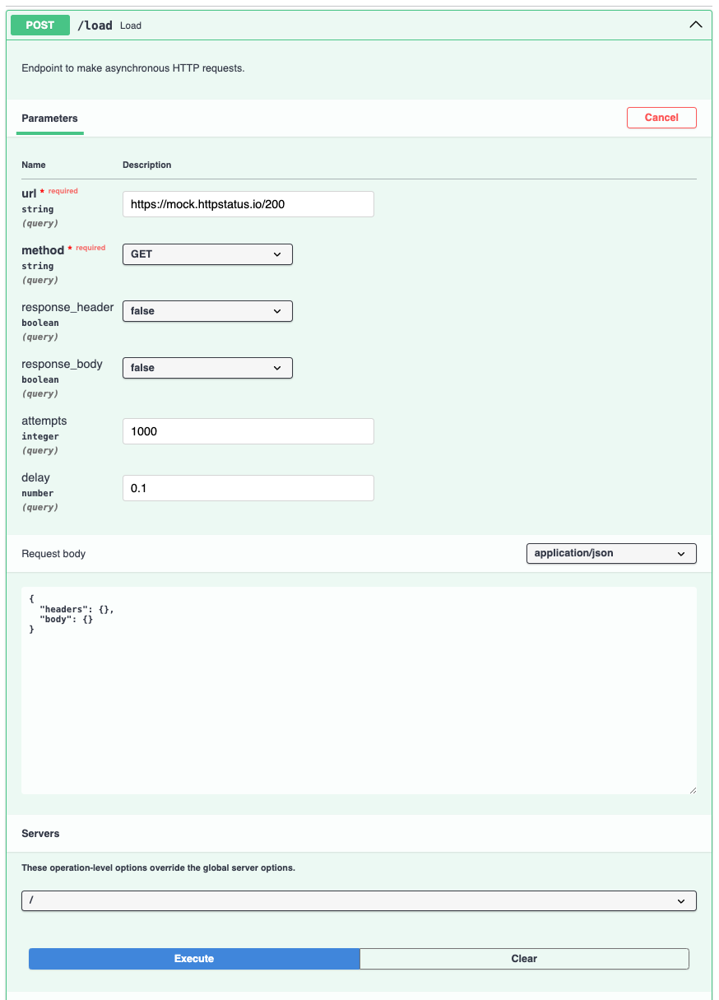
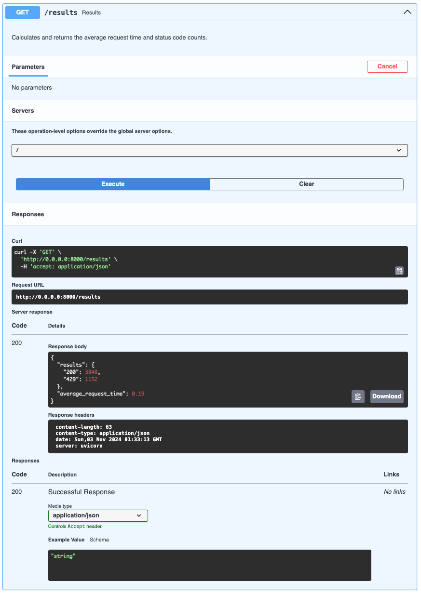

# SCAPI


> Dead simple, **S**elf-**C**ontained, single-file **API** load testing tool built on FastAPI.

A lightweight utility for quickly testing external APIs. It lets you generate a
small amount of load, experiment with headers, and measure average response
times — nothing more. The tool is designed to run anywhere with minimal setup:
just launch it and start testing, no extra configuration required.

## Features

- **Zero Configuration** - One file, one command;
- **Self-Contained** - Uses uv's inline metadata format;
- **FastAPI Swagger UI** - Beautiful web interface;
- **Async Load Testing** - Built on httpx and asyncio;
- **Real-time Results** - View metrics during execution;
- **Container Ready** - Works in any Python environment.

## Quick Start

### Installation

```bash
# Download the tool
curl -LOs https://github.com/sesav/scapi-py/releases/latest/download/scapi.py

# Install uv (if not already installed)
curl -LsSf https://astral.sh/uv/install.sh | sh

# Run the tool
uv run scapi.py
```

### Usage

1. Open http://localhost:8000 in your browser
2. Use the `/load` endpoint to send requests
3. Check `/results` for metrics and response times

## API Reference

### POST /load
Send load test requests to a target URL.

**Parameters:**
* `url` (string, required) - Target URL to test;
* `method` (string, required) - HTTP method (GET, POST, PUT, etc.);
* `attempts` (int, default: 10) - Number of requests to send;
* `delay` (float, default: 0.1) - Delay between requests in seconds;
* `headers` (object, optional) - Custom HTTP headers;
* `body` (object, optional) - Request body for POST/PUT requests;
* `response_header` (bool, default: false) - Include response headers in logs;
* `response_body` (bool, default: false) - Include response body in logs.

### GET /results
Get aggregated test results and metrics.

**Response:**
```json
{
  "results": {
    "200": 10,
    "404": 2
  },
  "average_request_time": 0.25
}
```

## Docker Usage

```bash
docker run -ti --rm -p "8000:8000" python:3.12-slim-bookworm bash
```
Then follow the installation steps inside the container.

## Screenshots


*Configure your load test parameters*


*View real-time results and metrics*

## Limitations

A minimal, single-threaded, memory-based tool for quick API load tests. Designed to run anywhere
with Python and the uv binary, it generates a small number of requests and provides fast feedback
without heavy dependencies.
long-running benchmarks.

## Development

```bash
# Clone the repository
git clone https://github.com/sesav/scapi-py.git
cd scapi-py

# Install development dependencies
make install

# Run tests
make test

# Run
make run
```

## Requirements

- Python 3.12+
- uv package manager
- wget or curl (for installation)

## License

This project is licensed under the [MIT License](LICENSE).
